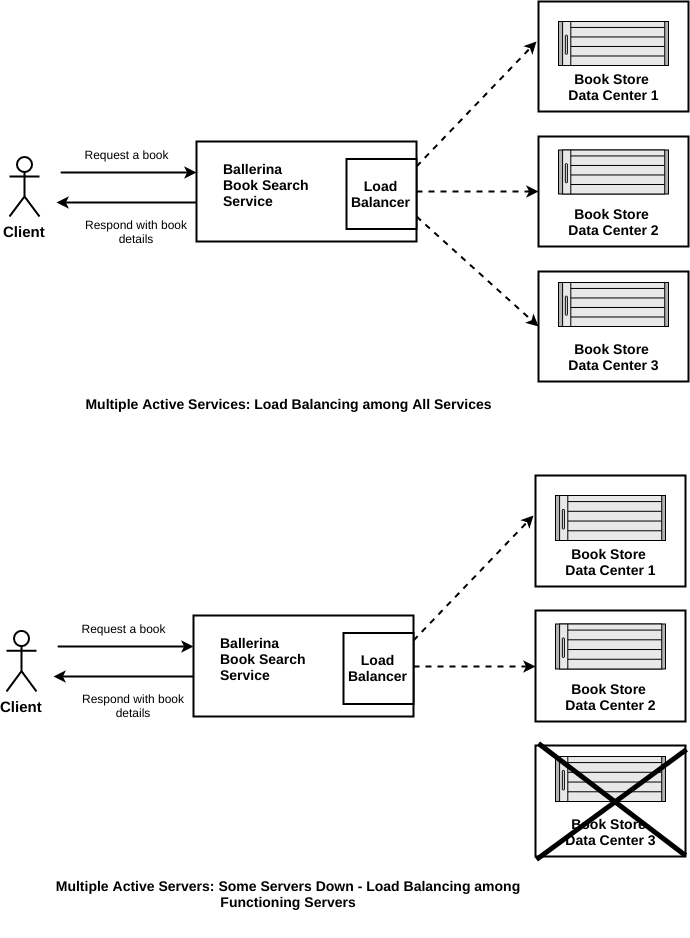

# Failover and Load Balancing
Load Balancing is efficiently distributing incoming network traffic across a group of backend servers and failover refers to a procedure by which a system automatically transfers control to a duplicate system when it detects a fault or failure. The combination of load balancing and failover techniques will create a highly available systems with eficiently distributing the workload amoung avaibale resources. Ballerina laguage supports load balancing and failover out-of-the-box.

> This guide walks you through the process of adding load balancing and failover for Ballerina programms.

The following are the sections available in this guide.

- [What you'll build](#what-you-build)
- [Prerequisites](#pre-req)
- [Developing the RESTFul service with load balancing and failover](#developing-service)
- [Testing](#testing)
- [Deployment](#deploying-the-scenario)
- [Observability](#observability)

## <a name="what-you-build"></a>  What you'll build

You’ll build a web service with loadbalancing and failover mechanisms. To understand this better, you'll be mapping this with a real world scenario of a book finding service. The book finding service will use three remote backends running three identical book store services to retrieve the book details.The failover and load balancing mechaisms help to balance the load amoung all the available remote servers.

&nbsp;
&nbsp;
&nbsp;
&nbsp;



&nbsp;
&nbsp;
&nbsp;

**Request book details from book search service**: To searcg a new book you can use the HTTP GET request that contains the book name as a path parameter.

## <a name="pre-req"></a> Prerequisites
 
- JDK 1.8 or later
- [Ballerina Distribution](https://github.com/ballerina-lang/ballerina/blob/master/docs/quick-tour.md)
- A Text Editor or an IDE 

### Optional requirements
- Ballerina IDE plugins ([IntelliJ IDEA](https://plugins.jetbrains.com/plugin/9520-ballerina), [VSCode](https://marketplace.visualstudio.com/items?itemName=WSO2.Ballerina), [Atom](https://atom.io/packages/language-ballerina))
- [Docker](https://docs.docker.com/engine/installation/)

## <a name="developing-service"></a> Developing the RESTFul service with circuit breaker

### Before you begin

#### Understand the package structure
The project structure for this guide should be as the following.

```
├── booksearchservice
│   └── book_search_service.bal
└── bookstorebacked
    └── book_store_service.bal
```

The `booksearchservice` is the service that handles the client orders to find books from book stores. Book search service is configured with three identical book store backeds to find book details. You can find the loadbalancing and failover mechanisms are applied when the book search service searches book from identical backends.

The `inventoryServices` is an independent web service that accepts orders via HTTP POST method from `orderService` and sends the availability of order items.

### Implementation of the Ballerina services

#### order_service.bal
The `ballerina.net.http.resiliency` package contains the circuit breaker implementation. After importing that package you can directly create an endpoint with a circuit breaker. The `endpoint` keyword in Ballerina refers to a connection with a remote service. You can pass the `HTTP Client`, `Failure Threshold` and `Reset Timeout` to the circuit breaker. The `circuitBreakerEP` is the reference for the HTTP endpoint with the circuit breaker. Whenever you call that remote HTTP endpoint, it goes through the circuit breaker. 

```ballerina
package orderServices;

import ballerina.log;
import ballerina.net.http.resiliency;
import ballerina.net.http;

@http:configuration {basePath:"/order"}
service<http> orderService {
    // The CircuitBreaker parameter defines an endpoint with the circuit breaker pattern
    // The circuit breaker immediately drop remote calls if the endpoint exceeds the failure threshold
    endpoint<resiliency:CircuitBreaker> circuitBreakerEP {
        // Circuit Breaker should be initialized with HTTP Client, failure threshold and reset timeout
        // HTTP client could be any HTTP endpoint that has risk of failure
        // Failure threshold should be 0 and 1
        // The reset timeout for the circuit breaker should be in milliseconds
        create resiliency:CircuitBreaker(create http:HttpClient("http://localhost:9092", null),
                                         0.2, 20000);
    }
    
    @http:resourceConfig {
        methods:["POST"],
        path:"/"
    }
    resource orderResource (http:Connection httpConnection, http:InRequest request) {
        // Initialize the request and response message to send to the inventory service
        http:OutResponse outResponse = {};
        http:OutRequest outRequest = {};
        // Initialize the response message to send back to the client
        http:InResponse inResponse = {};
        http:HttpConnectorError err;
        // Extract the items from the JSON payload
        json items = request.getJsonPayload().items;
        // Send bad request message to the client if the request does not contain items JSON
        if (items == null) {
            outResponse.setStringPayload("Error: Please check the input JSON payload");
            // Set the response code as 400 to indicate a bad request
            outResponse.statusCode = 400;
            _ = httpConnection.respond(outResponse);
            return;
        }
        log:printInfo("Recieved Order : " + items.toString());
        // Set the outgoing request JSON payload with items
        outRequest.setJsonPayload(items);
        // Call the inventory backend with the item list
        inResponse, err = circuitBreakerEP.post("/inventory", outRequest);
        // If inventory backend contains errors, forward the error message to the client
        if (err != null) {
            log:printInfo("Inventory service returns an error:" + err.msg);
            outResponse.setJsonPayload({"Error":"Inventory Service did not respond",
            "Error_message":err.msg});
            _ = httpConnection.respond(outResponse);
            return;
        }
        // Send response to the client if the order placement was successful
        outResponse.setStringPayload("Order Placed : " + inResponse.getJsonPayload().toString());
        _ = httpConnection.respond(outResponse);
    }
}

```

Refer to the complete implementaion of the orderService in the [resiliency-circuit-breaker/orderServices/order_service.bal](/orderServices/order_service.bal) file.


#### inventory_service.bal 
The inventory management service is a simple web service that is used to mock inventory management. This service sends the following JSON message to any request. 
```json
{"Status":"Order Available in Inventory",   "items":"requested items list"}
```
Refer to the complete implementation of the inventory management service in the [resiliency-circuit-breaker/inventoryServices/inventory_service.bal](/inventoryServices/inventory_service.bal) file.

## <a name="testing"></a> Testing 


### Try it out

1. Run both the orderService and inventoryService by entering the following commands in sperate terminals from the sample root directory.
    ```bash
    $ ballerina run inventoryServices/
   ```

   ```bash
   $ ballerina run orderServices/
   ```

2. Invoke the orderService by sending an order via the HTTP POST method. 
   ``` bash
   curl -v -X POST -d '{ "items":{"1":"Basket","2": "Table","3": "Chair"}}' \
   "http://localhost:9090/order" -H "Content-Type:application/json"
   ```
   The order service sends a response similar to the following:
   ```
   Order Placed : {"Status":"Order Available in Inventory", \ 
   "items":{"1":"Basket","2":"Table","3":"Chair"}}
   ```
3. Shutdown the inventory service. Your order service now has a broken remote endpoint for the inventory service.

4. Invoke the orderService by sending an order via HTTP method.
   ``` bash
   curl -v -X POST -d '{ "items":{"1":"Basket","2": "Table","3": "Chair"}}' \ 
   "http://localhost:9090/order" -H "Content-Type
   ```
   The order service sends a response similar to the following:
   ```json
   {"Error":"Inventory Service did not respond","Error_message":"Connection refused, localhost-9092"}
   ```
   This shows that the order service attempted to call the inventory service and found that the inventory service is not available.

5. Invoke the orderService again soon after sending the previous request.
   ``` bash
   curl -v -X POST -d '{ "items":{"1":"Basket","2": "Table","3": "Chair"}}' \ 
   "http://localhost:9090/order" -H "Content-Type
   ```
   Now the Circuit Breaker is activated since the order service knows that the inventory service is unavailable. This time the order service responds with the following error message.
   ```json
   {"Error":"Inventory Service did not respond","Error_message":"Upstream service
   unavailable. Requests to upstream service will be suspended for 14451 milliseconds."}
   ```


### <a name="unit-testing"></a> Writing unit tests 

In Ballerina, the unit test cases should be in the same package and the naming convention should be as follows,
* Test files should contain the _test.bal suffix.
* Test functions should contain the test prefix.
  * e.g., testOrderService()

This guide contains unit test cases in the respective folders. The two test cases are written to test the `orderServices` and the `inventoryStores` service.
To run the unit tests, go to the sample root directory and run the following command
```bash
$ ballerina test orderServices/
```

```bash
$ ballerina test inventoryServices/
```

## <a name="deploying-the-scenario"></a> Deployment

Once you are done with the development, you can deploy the service using any of the methods listed below. 

### <a name="deploying-on-locally"></a> Deploying locally
You can deploy the RESTful service that you developed above in your local environment. You can use the Ballerina executable archive (.balx) that you created above and run it in your local environment as follows. 

```
$ ballerina run orderServices.balx 
```


```
$ ballerina run inventoryServices.balx 
```

### <a name="deploying-on-docker"></a> Deploying on Docker
(Work in progress) 

### <a name="deploying-on-k8s"></a> Deploying on Kubernetes
(Work in progress) 


## <a name="observability"></a> Observability 

### <a name="logging"></a> Logging
(Work in progress) 

### <a name="metrics"></a> Metrics
(Work in progress) 


### <a name="tracing"></a> Tracing 
(Work in progress) 
