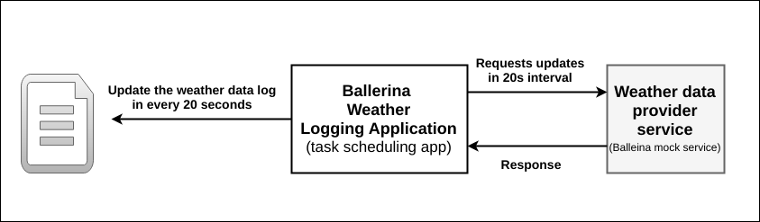

# Circuit Breaker
Task scheduling is a process where we can automate specific tasks to happen at a predefined time. With Ballerina you can use [Cron syntax](http://www.nncron.ru/help/EN/working/cron-format.htm) to define time and frequency of various actions.

> This guide walks you through scheduling tasks with Ballerina. 

The following are the sections available in this guide.

- [What you'll build](#what-you-build)
- [Prerequisites](#pre-req)
- [Developing the Ballerina task scheduling application](#developing-service)
- [Testing](#testing)
- [Deployment](#deploying-the-scenario)
- [Observability](#observability)

## <a name="what-you-build"></a>  What you'll build

You’ll build an application that schedules task for every 20 seconds time interval. Since Ballerina language is fine tuned for integration, we'll develop task scheduling application that periodically calls a remote weather service and logs the data into a file.



# <a name="pre-req"></a> Prerequisites
 
- JDK 1.8 or later
- [Ballerina Distribution](https://github.com/ballerina-lang/ballerina/blob/master/docs/quick-tour.md)
- A Text Editor or an IDE 

### Optional requirements
- Ballerina IDE plugins ([IntelliJ IDEA](https://plugins.jetbrains.com/plugin/9520-ballerina), [VSCode](https://marketplace.visualstudio.com/items?itemName=WSO2.Ballerina), [Atom](https://atom.io/packages/language-ballerina))
- [Docker](https://docs.docker.com/engine/installation/)

## <a name="developing-service"></a> Developing the Ballerina task scheduling application

### Before you begin

#### Understand the package structure
Ballerina is a complete programming language that can have any custom project structure that you wish. Although the language allows you to have any package structure, use the following package structure for this project to follow this guide.

```
├── data
│   └── weather_data.txt
├── taskscheduler
│   ├── weather_update_application.bal
│   └── weather_update_application_test.bal
└── weatherservice
    ├── weather_service.bal
    └── weather_service_test.bal
```

The `taskscheduler` is the main program that schedules tasks. This task scheduling program will call remote weather backend in every 20 second time ineterval. After recieving weather data the task scheduling application will log that data in to a file.

The `weatherservice` is an independent web service that accepts requests via HTTP POST method from `taskscheduler` and respond with the current weather data.

### Implementation of the Ballerina task scheduling application

#### weather_update_application.bal
The `ballerina.task` package contains the task scheduler implementation. After importing that package you can directly create task schedule appoinment. The `task:scheduleAppointment(onTrigger, onError, scheduleCronExpression)` will initiate the task. * First, need to pass onTrigger function(should return error) which suppose to be run on trigger by the task scheduler.
* Next, you need to pass onError function(should accepet error as an argument) that specify the action when an error occured at ioTrigger function.
* Finaly, you need to pass the scheduleCronExpression string which specifies the Cron expression of the schedule.

```ballerina
package taskscheduler;

import ballerina.file;
import ballerina.io;
import ballerina.log;
import ballerina.net.http;
import ballerina.task;
import ballerina.time;

const string FILE_NAME = "./data/weather_data.txt";

public function main (string[] args) {

    // Initialize the functions needed for task scheduler
    function () returns (error) onTriggerFunction;
    function (error e) onErrorFunction;
    // Assign the functions for on trigger and on error
    onTriggerFunction = getWeatherSummary;
    onErrorFunction = taskSchedulerError;
    // Schedule the tasks using scheduleAppointment function
    // Provide onTrigger function and onError functions as first two arguments
    // Finally pass the task execution intervals as Cron syntax
    // The syntax "0/20 * * * * ?' means that the task should run every 20 seconds
    _, _ = task:scheduleAppointment(onTriggerFunction, onErrorFunction,
                                    "0/20 * * * * ?");
}

function getWeatherSummary () returns (error) {
    endpoint<http:HttpClient> weatherEndpoint {
        create http:HttpClient("http://localhost:9090/weather", {});
    }

    log:printInfo("Calling weather service endpoint...");
    // Initialize the requests and responses
    http:OutRequest outRequest = {};
    http:InResponse inResponse = {};
    http:HttpConnectorError weatherServiceError;
    // Get the current system time
    time:Time time = time:currentTime();
    // Build a time string
    string timeString = string `{{time.hour()}}:{{time.minute()}}:{{time.second()}}`;
    // Set the request payload to send to the remote weather service
    json requestJsonPayload = {"city":"London", "time":timeString};
    outRequest.setJsonPayload(requestJsonPayload);

    // Call the remote weather service
    inResponse, weatherServiceError = weatherEndpoint.post("/summary", outRequest);

    // Check for errors in the response from the weather backend
    if (weatherServiceError == null) {
        string weatherUpdate = inResponse.getJsonPayload().toString();
        // Print the weather update
        log:printInfo(weatherUpdate);
        // Write the weather data to a file
        writeToFile(weatherUpdate);
    }
    return (error)weatherServiceError;
}

function taskSchedulerError (error e) {
    // Log the error if getWeatherSummary returns an error
    log:printErrorCause("[ERROR]", e);
}

function writeToFile (string weatherData) {
    log:printInfo("Writing weather data to the file...\n");

    // Initialize the File using global path "FILE_NAME"
    file:File targetFile = {path:FILE_NAME};
    // Open the file with Append access
    targetFile.open(file:A);
    // Open the bite channel with append access
    io:ByteChannel channel = targetFile.openChannel("A");
    weatherData = weatherData + "\n";
    // Write the current weather data to the byte channel
    _ = channel.writeBytes(weatherData.toBlob("UTF-8"), 0);
    // Close the file
    targetFile.close();
}

```

#### inventory_service.bal 
The inventory management service is a simple web service that is used to mock inventory management. This service sends the following JSON message to any request. 
```json
{"Status":"Order Available in Inventory",   "items":"requested items list"}
```
Refer to the complete implementation of the inventory management service in the [resiliency-circuit-breaker/inventoryServices/inventory_service.bal](/inventoryServices/inventory_service.bal) file.

## <a name="testing"></a> Testing 


### Try it out

1. Run both the orderService and inventoryService by entering the following commands in sperate terminals from the sample root directory.
    ```bash
    $ ballerina run inventoryServices/
   ```

   ```bash
   $ ballerina run orderServices/
   ```

2. Invoke the orderService by sending an order via the HTTP POST method. 
   ``` bash
   curl -v -X POST -d '{ "items":{"1":"Basket","2": "Table","3": "Chair"}}' \
   "http://localhost:9090/order" -H "Content-Type:application/json"
   ```
   The order service sends a response similar to the following:
   ```
   Order Placed : {"Status":"Order Available in Inventory", \ 
   "items":{"1":"Basket","2":"Table","3":"Chair"}}
   ```
3. Shutdown the inventory service. Your order service now has a broken remote endpoint for the inventory service.

4. Invoke the orderService by sending an order via HTTP method.
   ``` bash
   curl -v -X POST -d '{ "items":{"1":"Basket","2": "Table","3": "Chair"}}' \ 
   "http://localhost:9090/order" -H "Content-Type
   ```
   The order service sends a response similar to the following:
   ```json
   {"Error":"Inventory Service did not respond","Error_message":"Connection refused, localhost-9092"}
   ```
   This shows that the order service attempted to call the inventory service and found that the inventory service is not available.

5. Invoke the orderService again soon after sending the previous request.
   ``` bash
   curl -v -X POST -d '{ "items":{"1":"Basket","2": "Table","3": "Chair"}}' \ 
   "http://localhost:9090/order" -H "Content-Type
   ```
   Now the Circuit Breaker is activated since the order service knows that the inventory service is unavailable. This time the order service responds with the following error message.
   ```json
   {"Error":"Inventory Service did not respond","Error_message":"Upstream service
   unavailable. Requests to upstream service will be suspended for 14451 milliseconds."}
   ```


### <a name="unit-testing"></a> Writing unit tests 

In Ballerina, the unit test cases should be in the same package and the naming convention should be as follows,
* Test files should contain the _test.bal suffix.
* Test functions should contain the test prefix.
  * e.g., testOrderService()

This guide contains unit test cases in the respective folders. The two test cases are written to test the `orderServices` and the `inventoryStores` service.
To run the unit tests, go to the sample root directory and run the following command
```bash
$ ballerina test orderServices/
```

```bash
$ ballerina test inventoryServices/
```

## <a name="deploying-the-scenario"></a> Deployment

Once you are done with the development, you can deploy the service using any of the methods listed below. 

### <a name="deploying-on-locally"></a> Deploying locally
You can deploy the RESTful service that you developed above in your local environment. You can use the Ballerina executable archive (.balx) that you created above and run it in your local environment as follows. 

```
$ ballerina run orderServices.balx 
```


```
$ ballerina run inventoryServices.balx 
```

### <a name="deploying-on-docker"></a> Deploying on Docker
(Work in progress) 

### <a name="deploying-on-k8s"></a> Deploying on Kubernetes
(Work in progress) 


## <a name="observability"></a> Observability 

### <a name="logging"></a> Logging
(Work in progress) 

### <a name="metrics"></a> Metrics
(Work in progress) 


### <a name="tracing"></a> Tracing 
(Work in progress) 
